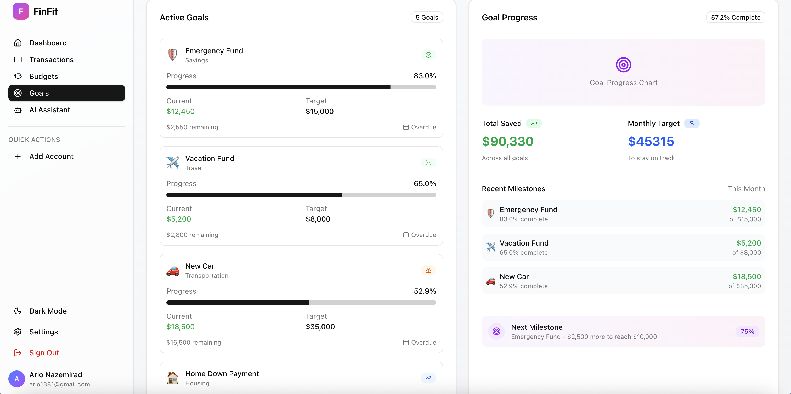

# 💸 FinFit - Your AI-Powered Financial Companion

[](https://nextjs.org/)
[](https://reactjs.org/)
[](https://www.typescriptlang.org/)
[](https://tailwindcss.com/)
[](LICENSE)

> **FinFit** helps you budget, save, and vibe — without boring spreadsheets. Take control of your money effortlessly with AI-powered insights and gamified progress tracking.

## 🚀 Features

### 💳 **Smart Banking Integration**

- **10-second bank sync** with Plaid integration
- Real-time transaction monitoring
- Automatic categorization
- Secure connection with 256-bit encryption

### 🤖 **AI Financial Assistant**

- Personalized spending insights
- Smart budget recommendations
- Financial goal optimization
- Natural language queries about your finances

### 📊 **Interactive Dashboard**

- Real-time balance tracking
- Spending analytics and charts
- Category breakdown visualization
- Activity feed with smart notifications

### 🎯 **Goal Setting & Tracking**

- Visual progress tracking
- Gamified savings challenges
- Milestone celebrations
- Smart goal recommendations

### 💰 **Budget Management**

- Custom budget categories
- Spending alerts and notifications
- Budget vs. actual tracking
- Monthly budget insights

### 🌙 **Dark/Light Mode**

- Beautiful theme switching
- Optimized for all lighting conditions
- Consistent design across themes

## 📱 Screenshots

### 🏠 **Landing Page**


_Modern, clean landing page with dark/light mode support_

### 📊 **Dashboard Overview**


_Comprehensive dashboard with balance, charts, and quick actions_

### 🤖 **AI Assistant**


_AI-powered financial insights and recommendations_

### 🎯 **Goals & Progress**


_Visual goal tracking with gamified progress_

### 💰 **Budget Management**


_Smart budget tracking with category breakdown_

### 💳 **Transaction History**


_Detailed transaction history with smart categorization_

## 🛠️ Tech Stack

### **Frontend**

- **Next.js 15** - React framework with App Router
- **React 19** - Latest React with concurrent features
- **TypeScript** - Type-safe development
- **Tailwind CSS 4** - Utility-first CSS framework
- **Framer Motion** - Smooth animations and transitions

### **Backend & Services**

- **Supabase** - Database and authentication
- **Clerk** - User authentication and management
- **Plaid API** - Banking integration
- **Chart.js** - Data visualization

### **UI Components**

- **Radix UI** - Accessible component primitives
- **Lucide React** - Beautiful icons
- **Class Variance Authority** - Component variants

## 🚀 Getting Started

### Prerequisites

- Node.js 18+
- npm or yarn
- Supabase account
- Plaid account (for banking integration)

### Installation

1. **Clone the repository**

   ```bash
   git clone https://github.com/yourusername/finfit.git
   cd finfit
   ```

2. **Install dependencies**

   ```bash
   npm install
   # or
   yarn install
   ```

3. **Set up environment variables**

   ```bash
   cp .env.example .env.local
   ```

   Add your environment variables:

   ```env
   # Supabase
   NEXT_PUBLIC_SUPABASE_URL=your_supabase_url
   NEXT_PUBLIC_SUPABASE_ANON_KEY=your_supabase_anon_key

   # Clerk Authentication
   NEXT_PUBLIC_CLERK_PUBLISHABLE_KEY=your_clerk_key
   CLERK_SECRET_KEY=your_clerk_secret

   # Plaid
   PLAID_CLIENT_ID=your_plaid_client_id
   PLAID_SECRET=your_plaid_secret
   PLAID_ENV=sandbox
   ```

4. **Run the development server**

   ```bash
   npm run dev
   # or
   yarn dev
   ```

5. **Open your browser**
   Navigate to [http://localhost:3000](http://localhost:3000)

## 📁 Project Structure

```
finfit/
├── src/
│   ├── app/                    # Next.js App Router
│   │   ├── (auth)/            # Authentication pages
│   │   ├── dashboard/         # Main dashboard
│   │   ├── budgets/           # Budget management
│   │   ├── goals/             # Goal tracking
│   │   ├── transactions/      # Transaction history
│   │   ├── ai-assistant/      # AI features
│   │   └── onboarding/        # User onboarding
│   ├── components/            # Reusable components
│   │   ├── ui/               # Base UI components
│   │   ├── dashboard/        # Dashboard-specific components
│   │   ├── budgets/          # Budget components
│   │   ├── goals/            # Goal components
│   │   └── ai-assistant/     # AI components
│   ├── hooks/                # Custom React hooks
│   └── lib/                  # Utilities and configurations
├── public/                   # Static assets
└── package.json
```

## 🎨 Key Features Explained

### **AI-Powered Insights**

- Natural language processing for financial queries
- Personalized spending recommendations
- Smart categorization of transactions
- Predictive analytics for future spending

### **Gamified Experience**

- Progress bars and achievements
- Streak tracking for consistent saving
- Reward system for meeting goals
- Social features for accountability

### **Security First**

- Bank-level encryption (256-bit)
- Secure Plaid integration
- OAuth 2.0 authentication
- GDPR compliant data handling

### **Responsive Design**

- Mobile-first approach
- Optimized for all screen sizes
- Touch-friendly interface
- Progressive Web App (PWA) ready

## 🤝 Contributing

We welcome contributions! Please see our [Contributing Guidelines](CONTRIBUTING.md) for details.

### Development Workflow

1. Fork the repository
2. Create a feature branch (`git checkout -b feature/amazing-feature`)
3. Commit your changes (`git commit -m 'Add amazing feature'`)
4. Push to the branch (`git push origin feature/amazing-feature`)
5. Open a Pull Request

## 📄 License

This project is licensed under the MIT License - see the [LICENSE](LICENSE) file for details.

## 🙏 Acknowledgments

- [Plaid](https://plaid.com/) for secure banking integration
- [Clerk](https://clerk.com/) for authentication
- [Supabase](https://supabase.com/) for backend services
- [Tailwind CSS](https://tailwindcss.com/) for styling
- [Radix UI](https://www.radix-ui.com/) for accessible components

## 📞 Support

- **Email**: support@finfit.com
- **Discord**: [Join our community](https://discord.gg/finfit)
- **Twitter**: [@finfit_app](https://twitter.com/finfit_app)

## 🚀 Roadmap

- [ ] **Mobile App** - Native iOS and Android apps
- [ ] **Investment Tracking** - Portfolio management
- [ ] **Bill Reminders** - Smart bill payment tracking
- [ ] **Family Accounts** - Shared financial management
- [ ] **Tax Preparation** - Automated tax document generation
- [ ] **Credit Score Monitoring** - Real-time credit score tracking

---

<div align="center">
  <p>Made with ❤️ by the FinFit team</p>
  <p>Take control of your financial future today!</p>
</div>
